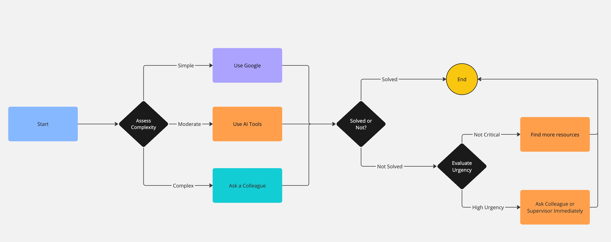

# When you get stuck - what next?

## Flowchart

## Reflections

- **When do you prefer using AI vs. searching Google?**
  **AI:**

  - When I need a explanation step by step to breakdown a problem.
  - When I’m looking for quick brainstorming or insights on less common issues.

  **Google:**

  - The problem seems common and there is a large amount of existing documentation.
  - I need to verify multiple sources or check the latest updates from official documentation.
  - I’m searching for community-driven discussions on specific error messages.

- **How do you decide when to ask a colleague instead?**
- he problem is highly specific to our project or domain and may involve internal practices or proprietary logic.
- I have already tried searching online and using AI tools but haven’t found a clear solution.
- The issue is urgent and requires immediate feedback or collaborative troubleshooting.

- **What challenges do developers face when troubleshooting alone?**
  **Limited Perspective:**  
  Working alone can sometimes lead to tunnel vision, where you may overlook alternative solutions.
  **Isolation:**  
  Developers may feel isolated when stuck on a complex problem, which can increase stress and slow down progress.
